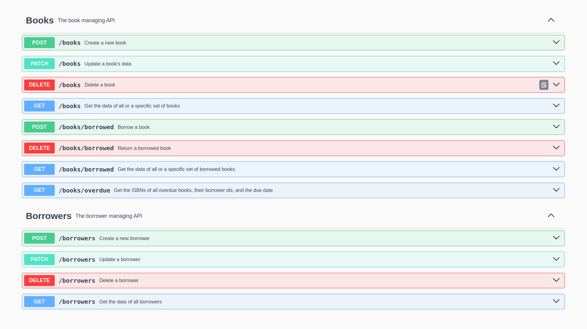
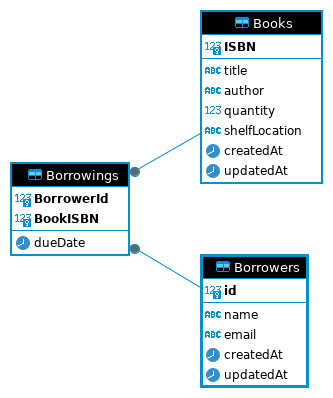

# Library Management System
This is a small express.js project that implements a REST API to manage books, borrowers, and borrowing.


***Api preview***

***Schema diagram***

# How to use
## Dependencies
1. Postgresql
2. NodeJS (tested on v21.4.0) 

## Setup
### Postgres
For postgres, you just need to set the password of the default user to `password`. Postgres already sets up a user on Linux systems.
```
sudo -u postgres -i
psql
```

Then `\password`, write your password twice (preferably "password" for testing purposes)
Change any needed variables in the `.env` file.

### Node
Just run `npm install`, this should install all the needed packages.

## Running
Just run `npm start` from your terminal. The database should be created with the name specified in the `.env` file, along with all the needed tables. You can go to `localhost:${SERVER_PORT}/api-docs` to check out the documentation of all available endpoints.


